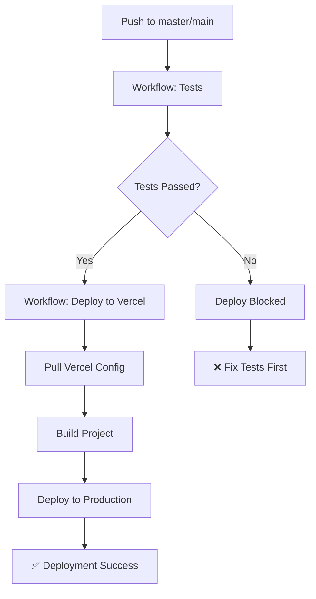

# Integração CI/CD com Vercel

Este documento descreve como configurar o deploy na Vercel condicionado ao sucesso do pipeline de testes do GitHub Actions.

## 📋 Sumário

- [Abordagens Disponíveis](#abordagens-disponíveis)
- [Opção 1: workflow_run (Implementada)](#opção-1-workflow_run-implementada)
- [Opção 2: GitHub Environments](#opção-2-github-environments)
- [Opção 3: Status Checks na Vercel](#opção-3-status-checks-na-vercel)
- [Configuração de Secrets](#configuração-de-secrets)
- [Desabilitar Deploy Automático da Vercel](#desabilitar-deploy-automático-da-vercel)

## 🎯 Abordagens Disponíveis

### Opção 1: workflow_run (Implementada)

**Vantagens:**
- ✅ Controle total via GitHub Actions
- ✅ Não requer configuração manual no GitHub (além dos secrets)
- ✅ Feedback claro quando testes falham
- ✅ Deploy só acontece após testes passarem

**Como funciona:**
1. Push no branch `master`/`main` dispara o workflow `Tests`
2. Após conclusão do workflow `Tests`, o workflow `Deploy to Vercel` é disparado
3. Se os testes passaram → Deploy executado
4. Se os testes falharam → Deploy bloqueado com mensagem clara

**Arquivo:** `.github/workflows/deploy-vercel.yml`

```yaml
on:
  workflow_run:
    workflows: ["Tests"]
    types:
      - completed
    branches: [ master, main ]

jobs:
  deploy:
    if: ${{ github.event.workflow_run.conclusion == 'success' }}
    # ... steps de deploy
```

### Opção 2: GitHub Environments

**Vantagens:**
- ✅ Interface visual no GitHub
- ✅ Controle granular de aprovações
- ✅ Histórico de deploys
- ✅ Proteção de branches

**Como configurar:**

#### 2.1. Criar Environment no GitHub

1. Acesse: `Settings` → `Environments` → `New environment`
2. Nome: `production`
3. Configure **Environment protection rules**:
   - ✅ Required reviewers (opcional)
   - ✅ **Wait timer** (opcional)
   - ✅ **Deployment branches**: Only selected branches → `master`, `main`

#### 2.2. Adicionar Required Status Checks

Na configuração do environment, adicione:
- `test (3.11)` ← do workflow Tests
- `test (3.12)` ← do workflow Tests
- `code-quality` ← do workflow Tests
- `build` ← do workflow Tests

#### 2.3. Modificar workflow de deploy

```yaml
# .github/workflows/deploy-vercel.yml
jobs:
  deploy:
    runs-on: ubuntu-latest
    environment:
      name: production
      url: https://seu-app.vercel.app
    
    steps:
    # ... steps de deploy
```

### Opção 3: Status Checks na Vercel

**Vantagens:**
- ✅ Configuração nativa da Vercel
- ✅ Integração automática com GitHub

**Como configurar:**

#### 3.1. Configurar na Vercel Dashboard

1. Acesse: `Project Settings` → `Git` → `Deploy Hooks`
2. Em **Ignored Build Step**, configure:

```bash
# Só faz build se o workflow de testes passou
if [ "$VERCEL_GIT_COMMIT_REF" == "master" ] || [ "$VERCEL_GIT_COMMIT_REF" == "main" ]; then
  # Verifica se há um workflow run bem-sucedido recente
  gh run list --workflow=tests.yml --branch=$VERCEL_GIT_COMMIT_REF --status=success --limit=1 --json conclusion --jq '.[0].conclusion' | grep -q success
  exit $?
else
  exit 1
fi
```

#### 3.2. Adicionar GitHub CLI ao projeto

```json
// package.json (criar se não existir)
{
  "devDependencies": {
    "@actions/github": "^5.1.1"
  }
}
```

#### 3.3. Configurar vercel.json

```json
{
  "github": {
    "enabled": true,
    "autoAlias": true,
    "silent": false
  },
  "build": {
    "env": {
      "GITHUB_TOKEN": "@github_token"
    }
  }
}
```

## 🔐 Configuração de Secrets

Para que o deploy funcione, você precisa configurar os seguintes secrets no GitHub:

### 1. Obter Tokens da Vercel

#### VERCEL_TOKEN
1. Acesse: https://vercel.com/account/tokens
2. Crie um novo token
3. Copie o token

#### VERCEL_ORG_ID e VERCEL_PROJECT_ID
Execute no terminal (com Vercel CLI instalada):

```bash
# Instalar Vercel CLI
npm install -g vercel

# Login
vercel login

# Link do projeto
vercel link

# Os IDs estarão em .vercel/project.json
cat .vercel/project.json
```

### 2. Adicionar Secrets no GitHub

1. Acesse: `Settings` → `Secrets and variables` → `Actions`
2. Clique em `New repository secret`
3. Adicione os seguintes secrets:

| Nome | Valor | Descrição |
|------|-------|-----------|
| `VERCEL_TOKEN` | Token gerado na Vercel | Token de autenticação |
| `VERCEL_ORG_ID` | ID da organização | Encontrado em `.vercel/project.json` |
| `VERCEL_PROJECT_ID` | ID do projeto | Encontrado em `.vercel/project.json` |

### 3. Verificar Secrets

```yaml
# Adicione este step no workflow para verificar (temporário)
- name: Verify secrets
  run: |
    echo "ORG_ID length: ${#VERCEL_ORG_ID}"
    echo "PROJECT_ID length: ${#VERCEL_PROJECT_ID}"
    echo "TOKEN length: ${#VERCEL_TOKEN}"
  env:
    VERCEL_ORG_ID: ${{ secrets.VERCEL_ORG_ID }}
    VERCEL_PROJECT_ID: ${{ secrets.VERCEL_PROJECT_ID }}
    VERCEL_TOKEN: ${{ secrets.VERCEL_TOKEN }}
```

## 🚫 Desabilitar Deploy Automático da Vercel

Para evitar deploys duplicados, você precisa desabilitar o deploy automático da Vercel:

### Opção A: Via Vercel Dashboard

1. Acesse: `Project Settings` → `Git`
2. Em **Deploy Hooks**:
   - Desmarque: ✅ Deploy on Push
   - Ou configure **Production Branch** para `none`

### Opção B: Via vercel.json

```json
{
  "github": {
    "enabled": false,
    "autoAlias": false,
    "silent": true
  }
}
```

### Opção C: Manter Vercel para PRs, GitHub Actions para Production

```json
{
  "github": {
    "enabled": true,
    "autoAlias": false,
    "silent": false,
    "deploymentEnabled": {
      "main": false,
      "master": false
    }
  }
}
```

## 📊 Fluxo de Deploy Completo



## 🔍 Verificação e Troubleshooting

### Verificar se o workflow está funcionando

1. Acesse: `Actions` no GitHub
2. Verifique se há dois workflows:
   - ✅ Tests (executando primeiro)
   - ✅ Deploy to Vercel (executando após Tests)

### Debug do workflow_run

Adicione este step para debug:

```yaml
- name: Debug workflow_run
  run: |
    echo "Event name: ${{ github.event_name }}"
    echo "Workflow run conclusion: ${{ github.event.workflow_run.conclusion }}"
    echo "Workflow run status: ${{ github.event.workflow_run.status }}"
    echo "Workflow run id: ${{ github.event.workflow_run.id }}"
```

### Problemas Comuns

#### 1. Deploy não dispara após testes

**Causa:** Nome do workflow não corresponde  
**Solução:** Verifique se o nome em `workflow_run.workflows` corresponde exatamente ao `name` no workflow de testes:

```yaml
# tests.yml
name: Tests  # ← Este nome deve ser exato

# deploy-vercel.yml
on:
  workflow_run:
    workflows: ["Tests"]  # ← Deve corresponder exatamente
```

#### 2. Deploy acontece mesmo com testes falhando

**Causa:** Condição `if` incorreta ou ausente  
**Solução:**

```yaml
jobs:
  deploy:
    if: ${{ github.event.workflow_run.conclusion == 'success' }}
```

#### 3. Secrets não encontrados

**Causa:** Secrets não configurados ou com nomes incorretos  
**Solução:** Verifique em `Settings` → `Secrets and variables` → `Actions`

#### 4. Vercel CLI falha

**Causa:** Token inválido ou projeto não configurado  
**Solução:** Execute `vercel link` localmente primeiro

## 📚 Recursos Adicionais

- [GitHub Actions: workflow_run](https://docs.github.com/en/actions/using-workflows/events-that-trigger-workflows#workflow_run)
- [Vercel CLI Documentation](https://vercel.com/docs/cli)
- [GitHub Environments](https://docs.github.com/en/actions/deployment/targeting-different-environments/using-environments-for-deployment)
- [Vercel GitHub Integration](https://vercel.com/docs/deployments/git/vercel-for-github)

## 🎓 Recomendação

Para este projeto, recomendo usar a **Opção 1 (workflow_run)** que já está implementada, pois:

1. ✅ Simples de configurar
2. ✅ Controle total via código (Infrastructure as Code)
3. ✅ Feedback claro em caso de falha
4. ✅ Não requer configurações manuais complexas no GitHub

Basta adicionar os secrets do Vercel e pronto!
